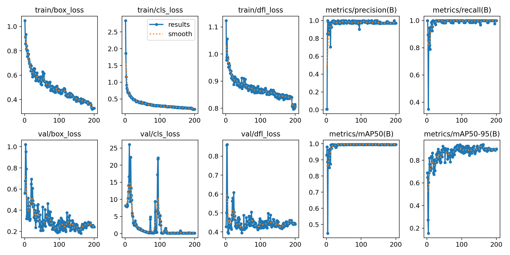

### Подготовка и разметка данных
#### 1. **Стратегия разметки**
- **Целевой класс**: `dish` (только тарелки/блюда)
    - Исключены: чашки, чайники и другие предметы сервировки
- **Частота выборки**: 1 кадр/сек для баланса между:
    - Полнотой данных
    - Эффективностью разметки

Я использовал сервис Roboflow для разметки. 
Тк на видео тарелки практически не двигаются, я решил нарезать 1 картинку из видео в секунду, это ускорило процесс разметки. После того как я разметил 1 видео, я воспользовался авторазметкой на Roboflow с помощью модели DinoV2. Далее я валидировал результаты авто рахметки.
Далее я решил поместить видео 4.1 в тест, видео 4 в val и все остальное в трейн. Видео 4.1 является частью видео 4 и оно не очень длинное, поэтому я поместил его в тест. Такми образом вал и трейн не пересекались.

Ссылка на мой проект, в нем можно посмотреть данные и модель
https://app.roboflow.com/dish-workspace/dish-detection-46kxn/models/dish-detection-46kxn/3

Структура данных следующая:
```
.
├── 4_1.MOV
├── data.yaml
├── README.dataset.txt
├── README.roboflow.txt
├── test
│   ├── images
│    │   ├──4_1_MOV-0000_jpg.rf.459a26874a321523f02fa508edc34365.jpg
│   └── labels
│    │   ├──4_1_MOV-0000_jpg.rf.459a26874a321523f02fa508edc34365.txt
├── train
│   ├── images
│   ├── labels
│   └── labels.cache
└── valid
    ├── images
    ├── labels
    └── labels.cache
```


### Обучение модели
Использовалась предобученная модель yolo11n

Обучение проводилось со следующими параметрами:

- Разрешение входных данных: 640×640 пикселей
- Количество эпох: 200
- Размер батча: 16
- Аугментации: случайные повороты (±10°), изменение оттенка HSV на ±1.5%, мозаичная аугментация,  сдвиг на 10% от размера изображения, масштабирование от 50% до 150%

Также для оптимизации гиперапараметров я использовал библиотеку optuna и оптимизировал параметры 
- lr0: [1e-5,1e-2]
- weight_decay: [1e-6,1e-3]
- dropout: [0.0,0.5]

В итоге получились такие параметры:
```
Params: {'lr0': 0.0007523860096860234, 'weight_decay': 0.00044754051935522854, 'dropout': 0.0635240811845541}
```


Метрики:
"На валидационном наборе модель достигла следующих показателей:
- mAP@0.5: 0.98
- Precision: 0.96
- Recall: 0.99
    На тестовом наборе (видео 4.1) модель показала mAP@0.5: 0.95, что свидетельствует о хорошей обобщающей способности.

###### Без оптимизации гиперпараметров метрика mAP@0.5 = 0.93

### Графики лосс функций и метрики mAP


### Результаты тестирования

Видео [`test_y/results.mp4`](./test_y/results.mp4) демонстрирует работу модели на тестовом наборе данных с визуализацией предсказаний:

- **Источник данных**: Видео из тестового набора (4_1.MOV)
- **Визуализация**:
  - Синие bounding boxes с предсказанными классами
  - Confidence score для каждого обнаруженного объекта
- **Параметры детекции**:
  - Confidence threshold: 0.25
  - IOU threshold: 0.7

**Ключевые наблюдения**:
1. Модель успешно детектирует:
   - Основные блюда (класс `dish`)
   - Статичные объекты на столе
2. Проблемные случаи:
   - Частично закрытые блюда (ложкой/рукой)
   - Резкое передвижение объекта

### Воспроизведение результатов

Неоходимо указать путь к данным в файле train.py записав его в переменную DATA_PATH

```
pip install -r requirements.txt
```

Базовый запуск (без оптимизации гиперпараметров)
```
python3 src/setup.py
```

Запуск с оптимизацией гиперпараметров (используя Optuna)
```
python3 src/setup.py --hpo --trials 10
```

Где:
- `--hpo` - флаг для активации оптимизации гиперпараметров
- `--trials 10` - количество итераций оптимизации (по умолчанию 5)


Все артефакты сохраняются в:

```
outputs/
├── {experiment_name}/
│   ├── weights/            # Веса модели
│   ├── args.yaml         # Параметры эксперимента
```


В результате эксперимента также сохранятся графики в папку outputs/{experiment_name}
В ней также будут логи для tensorboard, где можно более подробно посмотреть графики

Для визуализации метрик:

```
tensorboard --logdir=outputs/{train}/{experiment_name}
```

сервис будет доступен на http://localhost:6006/ 


### Итог:
Модель хорошо обучилась, метрики качества очень хорошие. Но на тестовом видео видно что сonfidence score падает на 20-30% для динамичных сцен и появляются ложные пропуски (false negatives). 
По графикам метрик видно что модель примерно за 20 эпох метрики достигли своего  максимального значения, лосс функции вышли на плато


### Время работы 
Мне потребовалось около 30 часов